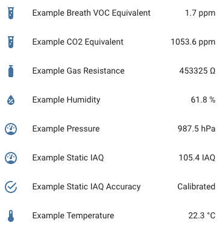

This component facilitates use of the Bosch BME680 sensor with [ESPHome](https://esphome.io) via the closed source [Bosch BSEC library](https://github.com/BoschSensortec/BSEC-Arduino-library) providing additional calculated indoor air quality measurements not available with the [core component](https://esphome.io/components/sensor/bme680.html):



## Installation
Copy the `bme680_bsec` directory into your ESPHome `custom_components` directory (creating it if it does not exist).

⚠️ **Note**: The Bosch BSEC library is only available for use after accepting its software license agreement. By enabling this component, you are explicitly agreeing to the terms of the [BSEC license agreement](https://www.bosch-sensortec.com/media/boschsensortec/downloads/bsec/2017-07-17_clickthrough_license_terms_environmentalib_sw_clean.pdf).

## Dependencies
The [I2C Bus](https://esphome.io/components/i2c.html#i2c) must be set up in order for this component to work.

## Minimal configuration
The following configuration shows the minimal set up to read temperature and humidity from the sensor.
```yaml
bme680_bsec:

sensor:
  - platform: bme680_bsec
    temperature:
      name: "BME680 Temperature"
    humidity:
      name: "BME680 Humidity"
```

## Advanced configuration
The following configuration shows all the available sensors and optional settings for the component. It also includes an example of filtering to guard against
outliers, limit the number of updates sent to home assistant and reduce storage requirements in other systems such as influxdb used to store historical data.

For each sensor all other options from [Sensor](https://esphome.io/components/sensor/index.html#config-sensor) and [TextSensor](https://esphome.io/components/text_sensor/index.html#base-text-sensor-configuration) are also available for filtering, automation and so on.

```yaml
bme680_bsec:
    # i2c address
    # -----------
    # Common values are:
    # - 0x76
    # - 0x77
    # Default: 0x76
    address: 0x76

    # Temperature offset
    # ------------------
    # Useful if device is in enclosure and reads too high
    # Default: 0
    temperature_offset: 0

    # IAQ calculation mode
    # --------------------
    # Available options:
    # - static (for fixed position devices)
    # - mobile (for on person or other moveable devices)
    # Default: static
    iaq_mode: static

    # Interval at which to save BSEC state
    # ------------------------------------
    # Default: 6h
    state_save_interval: 6h

sensor:
  - platform: bme680_bsec
    temperature:
      name: "BME680 Temperature"
      filters:
        - median
    pressure:
      name: "BME680 Pressure"
      filters:
        - median
    humidity:
      name: "BME680 Humidity"
      filters:
        - median
    gas_resistance:
      name: "BME680 Gas Resistance"
      filters:
        - median
    iaq:
      name: "BME680 IAQ"
      filters:
        - median
    co2_equivalent:
      name: "BME680 CO2 Equivalent"
      filters:
        - median
    breath_voc_equivalent:
      name: "BME680 Breath VOC Equivalent"
      filters:
        - median

text_sensor:
  - platform: bme680_bsec
    iaq_accuracy:
      name: "BME680 IAQ Accuracy"
```

## Multiple sensors
By defining multiple platform instances it is possible to read from multiple sensors.
```yaml
bme680_bsec:
  - id: bme680_one
    address: 0x76
  - id: bme680_two
    address: 0x77

sensor:
  - platform: bme680_bsec
    bme680_bsec_id: bme680_one
    temperature:
      name: "BME680 One Temperature"
  - platform: bme680_bsec
    bme680_bsec_id: bme680_two
    temperature:
      name: "BME680 Two Temperature"
```
